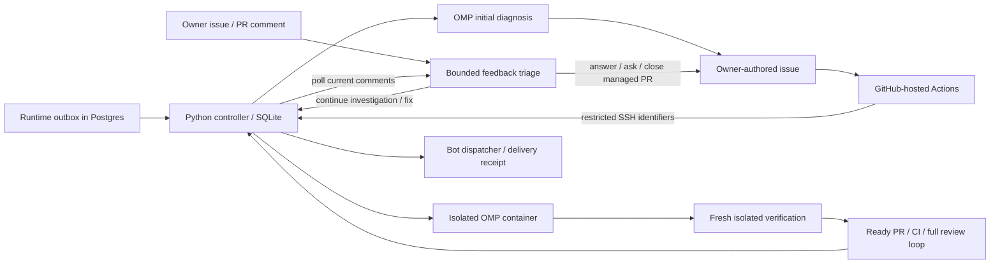

# Incident maintenance operations

This feature implements the incident → OMP diagnosis → issue → isolated repair
→ reviewed PR flow. It is disabled by default. This checkout does not provision
credentials, create GitHub labels/issues, install services on geta.moe, or enable
production automation. Merge and deployment remain operator actions.

The runtime captures fresh user-facing terminal routing failures independently
of Telegram delivery. `route_unavailable`, `no_candidates`, and
`all_attempts_exhausted` can be primary events; circuit/capacity failures and
individual attempts are explanatory evidence because failover can still succeed.
The first version does not detect a completely stopped bot.



## Runtime deployment

Migrations 185 and 186 are additive numbered up/down pairs. Migration 185 stores
an immutable, sanitized incident outbox plus private correlation fields; it does
not depend on the short-lived routing-event row surviving retention. Historical
attempts can become unavailable; the API reports that explicitly. Migration 186
stores notification intents and delivery receipts. Rollback requires disabling
maintenance first and discards these automation records, not bot history.

Deploy the reviewed main revision through the existing production procedure when
authorized. The production workflow uploads
`deploy/maintenance/compose.maintenance.yml` alongside the ordinary Compose file,
and the deploy script layers it automatically when the protected runtime
configuration exists. The overlay publishes the dedicated TLS listener only on
host loopback port 9092. Keep these values in
`/etc/openplotva-maintenance/runtime.env` on geta.moe:

- `MAINTENANCE_ENABLED=true` to capture incidents and serve the private API.
- `MAINTENANCE_TOKEN`: a new, independent 32–256 byte ASCII secret.
- `MAINTENANCE_NOTIFY_USER_ID`: a positive personal Telegram user ID already in
  `ADMINS_ADMIN_IDS`. Group/chat recipients are not accepted.

The deploy user does not need direct read access to the root-owned 0600 runtime
file. Each deploy reads it through the host's passwordless administrative path
into a mode-0600 temporary Compose interpolation file, removes that file on
exit, and never prints its contents. The source file remains the authority for
the enabled flag, token, and recipient, so later ordinary production deploys
preserve an enabled maintenance API instead of reverting it to the default
disabled state. If the overlay is present while an existing app is enabled but
the protected runtime file is unavailable, deployment stops before recreating
the app. Hosts without the optional overlay continue to use the production
Compose file alone.

The existing runtime GraphQL token is not accepted by the maintenance API. Copy
the actual runtime certificate through the existing trusted administrative path
to `/etc/openplotva-maintenance/runtime-api.crt`. The controller validates TLS;
never disable certificate verification. The certificate must cover `localhost`.
Persist the matching maintenance token in `maintenance.token`, mode 0600. Do not
put token values in commands, issue bodies, image layers, or logs.

## Host installation and credentials

Use a clean checkout at verified `origin/main` on geta.moe. Install Python 3.11+,
Git, GitHub CLI, Docker, iptables and the normal Linux filesystem tools (`mount`,
`umount`, `fallocate`, `mkfs.ext4`, `findmnt`). The installer refuses an unreviewed
branch or dirty checkout. It does not start or enable services.

```sh
docker build -f tools/maintenance/Dockerfile -t openplotva-maintenance:reviewed .
docker image inspect openplotva-maintenance:reviewed --format '{{.Id}}'
# Supply that verified immutable sha256 image ID:
sudo bash deploy/maintenance/install.sh sha256:ACTUAL_IMAGE_ID
```

The image pins Rust 1.95.0 and the upstream base-image digest. It pins OMP
18.1.14 and verifies the upstream release binary SHA-256 for amd64/arm64. Its
Cargo dependency cache comes from the trusted checkout's lockfile; execution
uses offline Cargo. A dependency change requiring a new cache needs an operator
image rebuild. Updating OMP or its image digest is a separate reviewed change.

Finish `/etc/openplotva-maintenance/config.json`: immutable image ID, exact
production container name, maintenance TLS paths and private token paths. The
installer fills the image only on first installation; later changes do not
silently replace operator configuration. Keep the configuration and secret files
root-owned and non-writable by the SSH ingress account.

Set `private_inventory_file` to a root-owned mode-0600 JSON file containing
`{"identifiers": ["private-provider-name", "private-model-name", "private-host"]}`.
Populate it privately from the current provider/model configuration and host
inventory, including display names, model aliases, endpoints and deployment
names. Do not include credentials or commit the real inventory. Update it when
configuration changes and restart the controller to refresh its adapter snapshot.
An unreadable, unsafe or malformed configured inventory prevents publication.
The controller additionally collects typed identities from each incident's
scoped evidence. The full inventory never enters a worker container.

Public issues, PR descriptions and review replies describe functional behavior,
evidence, hypotheses and acceptance checks. Identifying production specifics
remain in private incident evidence and SQLite job results. Deep/review workers
receive the original same-incident diagnosis through
`context.private.initial_diagnosis` and the original scoped evidence through
`context.private.initial_evidence`, including after a restart or expiration of
live attempt history. Public prose is
redacted and checked again at the GitHub adapter; patches and commit messages
are rejected rather than rewritten if they disclose identities. Recovered
prepared commits undergo this check again before any push or PR publication.
Only opaque publication markers are stored in GitHub HTML comments. Hidden
sections, edit history, filenames, removed diff lines and attachments are still
public and must never carry private context.

For an existing disclosure, disable new starts and stop the controller before
cleaning public artifacts; `disable` alone still permits result publication.
Preserve original diagnostics only in the protected state directory. Editing a
GitHub issue does not remove its earlier revisions or title timeline events;
history removal needs separate owner handling. Resume only after checking the
new publication boundary against retained private results and queued commits.

Provision a fine-grained **user** GitHub token belonging to `iamwavecut` (numeric
ID 239034), restricted to `iamwavecut/openplotva`: repository contents, issues and
pull requests write; Actions and checks read; metadata read. Store it in
`github.token`, mode 0600. The controller verifies the authenticated identity.
It uses the token only in trusted `gh` processes; neither token nor credential
helper enters the agent container. `GITHUB_TOKEN` is unsuitable for publication:
its generated issue events do not initiate this follow-up workflow. See
[GitHub event/token rules](https://docs.github.com/en/actions/how-tos/write-workflows/choose-when-workflows-run/trigger-a-workflow).

Provision the existing GLM Coding Plan credential into the separate
`openplotva-omp` account's native OMP broker profile using its supported login or
import procedure. The account's home must be `/var/lib/openplotva-omp`.
`PI_CONFIG_DIR=.omp` is a **directory name under that home**, not an absolute
path. Broker and gateway tokens therefore reside under
`/var/lib/openplotva-omp/.omp/`. Start the broker, then the gateway:

```sh
sudo systemctl start openplotva-omp-broker
sudo systemctl start openplotva-omp-gateway
sudo python3 /opt/openplotva-maintenance/preflight.py
```

Use only the Coding Plan `zai` profile. The job proxy maps `glm-5.3` to native
`zai/glm-5.3`, preventing accidental selection of a different provider's model.
The source key stays inside the broker; the worker receives a temporary job
capability. Provider errors or exhausted quota defer work; no paid fallback is
configured. Native configuration and protocol references are pinned to
[OMP 18.1.14 CLI](https://github.com/can1357/oh-my-pi/blob/v18.1.14/docs/cli-reference.md),
[auth broker/gateway](https://github.com/can1357/oh-my-pi/blob/v18.1.14/docs/auth-broker-gateway.md),
and [environment variables](https://github.com/can1357/oh-my-pi/blob/v18.1.14/docs/environment-variables.md).

## Restricted Actions ingress

Generate a dedicated SSH key. Store its private half as GitHub Actions secret
`MAINTENANCE_SSH_KEY`; store a previously verified geta.moe host-key line as
`MAINTENANCE_SSH_KNOWN_HOSTS`. Do not establish trust with an unchecked
`ssh-keyscan` result. Install the public key in the root-owned
`/var/lib/openplotva-maintenance-dispatch/.ssh/authorized_keys` with these options:

```text
restrict,command="sudo -n /usr/local/sbin/openplotva-maintenance-ingress \"$SSH_ORIGINAL_COMMAND\"" ssh-ed25519 PUBLIC_KEY
```

The ingress accepts only `enqueue ISSUE_NUMBER WORKFLOW_RUN_ID`. It rejects shell
syntax, extra arguments and arbitrary operations, then clears the environment
before invoking the trusted controller. Actions re-fetches the current issue;
the controller independently checks owner IDs, repository, both labels, issue
state, its durable provenance record, the trusted workflow run and its label
generation. Replayed opened/labeled/SSH deliveries share one reservation.
The Actions run means **accepted**, not repaired. Final status belongs to the
controller and bot delivery receipt.

## Controls and execution limits

```sh
sudo python3 /opt/openplotva-maintenance/controller.py status
sudo python3 /opt/openplotva-maintenance/controller.py disable
sudo python3 /opt/openplotva-maintenance/controller.py cancel JOB_ID
sudo systemctl start openplotva-maintenance
# Only after controlled validation:
sudo python3 /opt/openplotva-maintenance/controller.py enable
```

`disable` stops new starts; reconciliation and notification retries continue.
`cancel` stops the selected job's container and preserves its patch. Do not use
blanket Docker cleanup. After a process/host restart, journaled containers,
workspaces and GitHub effects are reconciled before another job starts.

Initial diagnosis and owner feedback triage share a 30-start rolling 24-hour
quota; each short job has a 600-second active limit, including retries.
New deep investigations have a 10-start rolling limit. An issue has at most
14,400 active seconds and five repair/review rounds across retries and manual
requeues. Waiting for CI releases the single compute slot. Status includes usage
counters and active time; model-reported usage is accounting, not an invoice.

Each container uses UID 1000, two CPUs, 4 GiB memory with no extra swap, a PID cap,
read-only root, no capabilities, and an 8 GiB ext4 workspace allocated with
`fallocate`. The supervisor requires 6 GiB available RAM and 16 GiB free disk
before allocating it, retaining an 8 GiB host reserve. During execution it stops
the job if free disk drops below that reserve or available RAM below 2 GiB.
Partial artifacts stay in the controller's private state directory.

The controller is a trusted root service because it creates the loop filesystem,
Docker network and firewall rules. Its mount namespace must be shared with the
host Docker daemon; the worker itself has no Docker socket, host home, production
network or host credential. An internal bridge plus explicit INPUT/FORWARD rules
permits only the per-job proxy. Verification gets a fresh container, cleared
workspace, no network or model capability, pinned source and validated patch.

## Outcome and recovery semantics

### Owner conversations

The controller reads current issue comments about once per minute, including
edited comments, on its open issues with both `agent:created` and `agent:queued`.
It also reads general discussion comments on open PRs whose creation is recorded
in its publication journal. Only `iamwavecut` with the configured numeric owner
ID can initiate a conversation. Comments from GitHub Apps and the controller's
own exact journaled replies are excluded; a quoted marker alone does not identify
an automated reply. Other reviewers remain inputs to the existing PR review
loop, but cannot initiate issue triage or authorize closing a PR.

First activation records a durable timestamp; older comments are not replayed.
Edit an older comment or write a new one to provide feedback. Repeated polling
and service restarts reuse the stored comment version. Pending edits are combined
before invoking OMP. Every new owner comment holds repair publication and stops
any running repair container while preserving its partial patch and usage.
The next short triage receives the discussion, original private evidence,
previous replies, the managed PR and remaining repair budget. Before each public
action the controller rechecks the owner comments, issue scope and PR identity.
Changes during a run invalidate its decision and require a fresh triage.

The bounded decision is one of:

- **reply**: answer or ask for missing facts in the discussion where the owner
  commented, and wait for further feedback. Existing repair work remains held.
- **continue**: resume diagnosis or revise the managed PR using the owner's
  latest guidance. The normal defect evidence, tests and lifetime repair budgets
  still apply. A new attempt after a closed PR does not reopen that PR.
- **close_pr**: close only the supplied controller-created PR after checking
  its recorded branch and unchanged HEAD; publish an explanation and retain the
  open issue, branch and artifacts. The action is journaled before transmission,
  including recovery from a lost GitHub acknowledgement. The API supports
  [updating PR state](https://docs.github.com/en/rest/pulls/pulls#update-a-pull-request);
  merge, issue closure and branch deletion are outside this decision contract.

Answers and questions pass through the same functional-description privacy
boundary as incident reports. No model, provider, host or internal identifier
belongs in a public response, including HTML comments or edit history. Diagnosis
and feedback are read-only evidence, never a grant of credentials or expanded
tool permissions. Short conversation jobs do not consume repair rounds. Exhausted
short-job quota leaves feedback queued; exhausted repair budget permits discussion
but prevents another automatic fix. Removing either service label revokes the
conversation scope. Disabling the service's new-start switch also defers triage.
The `status` command includes `owner_holds`, the issue numbers waiting on owner
feedback, alongside queued triage jobs, active time and usage counters.
A fresh owner re-add of `agent:queued` remains an explicit manual repair request:
it releases the conversation hold and supersedes pending short triage. Replayed
workflow events or a previously reserved label generation cannot release a hold.

Deterministic signatures coalesce repeats before OMP; the GitHub history index
supports semantic matching across open/closed issues and open/merged PRs.
Existing open work prevents a competing repair. A merged fix absent from the
running revision waits for deployment. Confirmed recurrence after deployment
creates a linked regression issue. Ordinary repeats after a no-fix investigation
update history; new causal evidence or an owner label re-add can request another
investigation within the issue's lifetime budget.

Labels are `agent:created` (origin), `agent:queued` (request), `needs-triage`
(uncertain cause), and `needs-human` (operator decision). Confirmed defects also
get `bug`. No-fix/uncertain results leave the issue open. Automated publication
cannot change this mechanism, deployment/workflows, agent rules or credentials.

GitHub intents are recorded before publication and reconciled by marker, branch
and commit, including uncertain network outcomes. A PR is ready only on the exact
verified HEAD after required CI and complete current review bodies/inline threads
are handled. A successful OMP exit alone proves nothing. No merge or deployment
command exists in the automation.

Notification POST only acknowledges a durable intent. `sent` requires a real
Telegram message ID returned through the existing dispatcher. Known pre-send
transport failures stay queued with bounded-rate backoff. A lost acknowledgement
or crash after transmission is `ambiguous`: the service does not invent delivery
confirmation or send a replacement that might duplicate it. Inspect the personal
chat and receipt before deciding how to recover. Bot downtime does not discard
pending notifications.

## Validation and activation sequence

1. Deploy only the disabled runtime/API, validate synthetic and recorded
   sanitized events and cursor replay, then inspect controller status while
   new starts remain disabled.
2. Verify the private GitHub identity, OMP Coding Plan profile, TLS and exact
   personal Telegram recipient. Run the offline semantic/recovery suite.
3. Build and test the pinned image, then perform the resource/isolation and
   controlled test-issue → PR → notification exercise on geta.moe. Keep merge
   and deploy manual. Check actual broker quota behavior and Telegram receipt.
4. Enable new jobs after the complete scenario passes. Observe the first real
   incident and exact PR HEAD; use `disable` or `cancel` if intervention is needed.

Local checks (no account credentials or public test issues required):

```sh
python3 -m unittest discover -s tools/maintenance/tests -v
MAINTENANCE_TEST_IMAGE=openplotva-maintenance:reviewed python3 -m unittest discover -s tools/maintenance/tests -p test_image.py -v
cargo fmt --all -- --check
cargo clippy --workspace --all-targets -- -D warnings
cargo test -p openplotva-config -p openplotva-storage -p openplotva-app maintenance --lib
```

Set the existing `OPENPLOTVA_TEST_POSTGRES_DSN` to a disposable Postgres instance
for live migration/outbox/dispatcher tests. Never point tests at production.
These tests do not replace a live GLM/SSH/Telegram/resource acceptance run on the
target host. The code must stay disabled until that separate activation is done.
