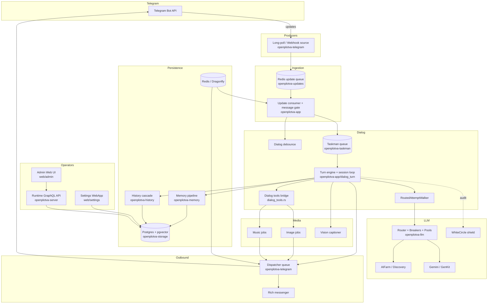
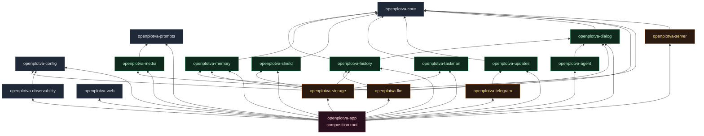
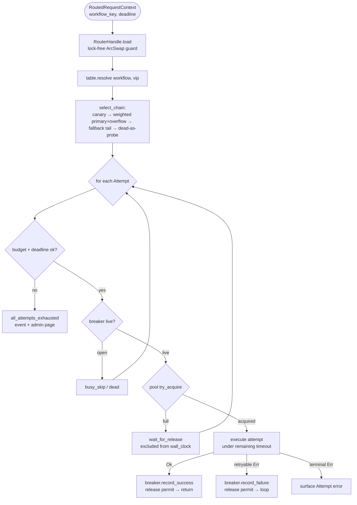
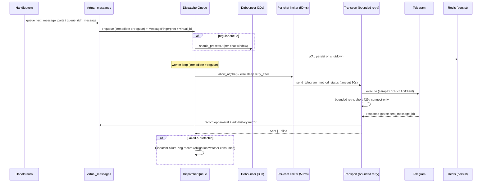
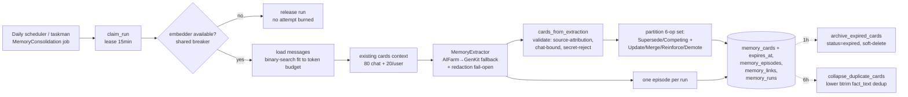

# OpenPlotva Codebase Map

> Auto-generated by Cartographer. Last mapped: 2026-07-06.
> Update 2026-07-06: merged deltas for centralized reply finalization (PR #17, deployed) and memory enrichment / consolidation op-set (PR #15, merged to main, not yet deployed). See "Recent Changes" below.

OpenPlotva is a Telegram bot + web service runtime written in Rust (~20-crate
workspace), migrated from a Go original (`go-plotva`). It provides an agentic
AI dialog (multi-step tool-calling turns), media generation (image / music /
vision / youtube), durable memory with bitemporal retrieval, content-safety
shield, Telegram Stars payments, a token-driven admin Web UI, and an operator
GraphQL "runtime API" for live diagnostics over pinned TLS.

The system runs as a single process backed by Postgres 17 + pgvector and
Dragonfly (= Redis). Producers/consumers of Telegram updates can be toggled
independently; all outbound sends flow through a persisted, debounced, deduped
dispatcher queue.

---

## Recent Changes (since 2026-07-05)

Two thematic clusters landed between the 2026-07-05 and 2026-07-06 maps:

### A. Centralized reply finalization — PR #17 (deployed to prod 2026-07-06)

Reply finalization was centralized in **`openplotva-dialog::finalize_dialog_reply`**; both the aifarm (`openplotva-llm/src/aifarm.rs`) and gemini (`openplotva-llm/src/gemini.rs`) providers now route through it. Pipeline: **suppress → retryable → regen**. A reply is classified into `DialogReplyOutcome::{Reply(String), Suppressed(DialogReplySuppression)}` where suppression is one of `Empty` / `ContextLeak` / `ProtocolOnly` / `ReasoningLeak` / `Pathological(String)`. Every suppression variant maps to a **retryable** provider error in both providers — a leak never silently empties a reply.

Key fixes folded in: reasoning-channel labels (`thought`/`analysis`/`commentary`) now matched **case-insensitively** and **line-scoped** (previously a title-case `Thought` label leaked the reasoning trace); gemini now **propagates the structured suppression reason** instead of clearing content to a generic "empty final text"; the residual-leak guard is narrowed to **marker-prefix-at-START** (`reply_has_residual_leak` does `lower.starts_with(marker)`, not substring), so tags quoted mid-reply pass through.

New public exports in `openplotva-dialog`: `finalize_dialog_reply`, `strip_reasoning_channels`, `reply_has_residual_leak`, `pathological_final_answer_reason` (moved here from aifarm), `DialogReplyOutcome`, `DialogReplySuppression`.

### B. Memory enrichment / consolidation op-set — PR #15 (merged to `main`, **not yet deployed**)

Four changes to the memory subsystem:

1. **Online consolidation op-set** — extraction `ResolutionDecision` extended from `{Supersede, Competing}` to six variants: **`Update` / `Merge` / `Reinforce` / `Demote`** are new in-place ops on existing cards (no new candidate_card row). The resolver lives in `openplotva-app/memory_runtime.rs::write_memory_extraction_cards` (partitions resolutions then applies each op against `MemoryWriteStore`).
2. **Compact existing-cards projection** — `ExtractInput::to_prompt_payload` now rewrites `existing_cards` into `CompactExistingCard {id, type, subject, fact, conf, age, disputed}` (drops SPO/storage bookkeeping fields, coarse age buckets, sorted by subject). Count caps unchanged (80 chat / 20 per participant) but each card is cheaper → more fit the token budget.
3. **Durability / TTL forgetting** — `CandidateCard.durability` (`permanent|long|short|ephemeral`) → `CardInput.expires_at` via `durability_ttl_days` (ephemeral=2d, short=14d, permanent/long=None). **Migration 152** adds `memory_cards.expires_at TIMESTAMPTZ` + `'expired'` status + a partial index. An **archival worker** (1h interval) soft-deletes expired cards (`status='expired'`, stamps `retracted_at` — bitemporal replay preserved; row excluded from retrieval by a TTL filter, not physically removed).
4. **Off-hours exact-duplicate collapse** — a 6h worker (`run_memory_duplicate_collapse_worker_until`) groups active cards by `lower(btrim(fact_text))` within `(visibility, chat_id, thread_id, user_id)`, keeps `min(id)` as survivor, retires the rest, sums `observation_count`. Each group runs in its own transaction.

Prompt bumped to **v5** (`prompts/memory/extraction.prompt`; `PROMPT_VERSION = "chat_memory_daily_v5"` in `openplotva-memory`); `claim_run` binds the version, so a v5 worker won't claim v4-queued runs.

Notable bug fixes: merge **supersede direction corrected**; merge re-embedding consumed via an `is_empty` filter (fixed embedding misalignment); **TTL cleared on durability promotion** (lexical upsert now carries `expires_at`, both upserts use `GREATEST`); duplicate-collapse made **per-group transactional**.

> **Deploy caveat**: cluster B (memory enrichment + migration 152) is on `main` but NOT yet deployed to prod. The running image still reflects the pre-PR-#15 memory behavior.

---

## System Overview



### Workspace topology (dependency layering)



Layering rule (enforced by AGENTS.md): **domain crates must not depend on web,
Telegram, SQLx, or vendor SDKs** unless the crate owns that integration
boundary. `openplotva-app` is the only crate that wires concrete
implementations together.

---

## Directory Structure

```
openplotva/
├── crates/                        # 18-crate Rust workspace (resolver = "3", edition 2024)
│   ├── openplotva-app/            # Composition root: config wiring, runtime startup, handlers, workers, HTTP
│   │   └── src/
│   │       ├── main.rs            # 6-line shim around run()
│   │       ├── lib.rs             # ~15.6k lines: RuntimeWorkers aggregate, run(), start_runtime_workers
│   │       ├── dialog_turn/       # Turn engine, session loop, budget, inbox, ledger, obligations, signal
│   │       ├── dialog_jobs/       # Taskman worker facade, input materializer, retry, effects, queue
│   │       ├── runtime_*.rs       # ~20 GraphQL/runtime-API inspector adapters + retention/SQL/safety
│   │       └── *.rs               # Feature handlers (admin, members, rates, translate, vision, music, …)
│   ├── openplotva-dialog/         # Provider-neutral dialog vocabulary: types, tool catalog, parsers, persona
│   ├── openplotva-agent/          # Durable, resumable agentic-loop engine (one step at a time)
│   ├── openplotva-llm/            # Provider clients (aifarm/gemini/whitecircle) + DB-free router control plane
│   ├── openplotva-telegram/       # Bot API boundary: dispatcher, transport, rich API, dedup, rate limit, Stars
│   ├── openplotva-storage/        # SQLx Postgres + Redis stores, embedded migrations, AES-GCM key sealing
│   ├── openplotva-taskman/        # Durable in-memory job queue core with WAL/snapshot codecs
│   ├── openplotva-server/         # Axum runtime API: Bearer auth, GraphQL, TLS, pprof stubs, token mechanics
│   ├── openplotva-web/            # Web asset registry + sha256 guards + Telegram signature/cookie primitives
│   ├── openplotva-memory/         # Memory extraction pipeline: cards, episodes, links, bitemporal retrieval
│   ├── openplotva-history/        # Chat-history summary cascade (token fitting, coverage-cursor merge)
│   ├── openplotva-media/          # Image optimizer, ACE-Step song client, public uploader
│   ├── openplotva-shield/         # Content-safety retrieval scoring + XML context injection
│   ├── openplotva-updates/        # Redis update queue + enqueue-update CLI binary
│   ├── openplotva-config/         # Typed AppConfig tree + env loader (single source of truth)
│   ├── openplotva-observability/  # tracing init + redacting log boundary + runtime log ring buffer
│   ├── openplotva-prompts/        # .prompt template loader (Handlebars + front matter + partials)
│   └── openplotva-core/           # Leaf: Telegram-domain primitives, settings, VIP math
├── web/
│   ├── admin/                     # Token-driven pl-* component library (design system, sha256-guarded)
│   └── settings/                  # Settings WebApp (Framework7 + Telegram theme, separate boundary)
├── migrations/                    # 152 numbered up/down SQL pairs (0_init → 151_retire_taskman_job_rollup)
├── prompts/                       # .prompt templates (chat/aifarm/xml/memory/history/agentic/image/music/vision/youtube)
├── tools/                         # Smoke scripts, Rust gates, db-reclaim, token-estimator microservice
├── .github/workflows/             # ci, rust-deep, security, deploy-production, pr-automation
├── deploy/production/             # compose.production.yml + idempotent deploy-production.sh
├── docs/superpowers/{plans,specs}/# Design history (richest architectural context)
├── plans/                         # Legacy numbered fix-plans (001-011)
├── skills/openplotva-*/           # Agent skills: deploy, design-system-review, runtime-api
├── Cargo.toml                     # Workspace manifest (18 members, sqlx 0.9, tokio, axum, async-graphql)
├── DESIGN.md                      # Admin design-system contract (token tiers, pl-* catalog, guards)
└── AGENTS.md                      # Operating rules, code style, architecture boundaries, delivery flow
```

---

## Module Guide

Modules are grouped by architectural layer. Each entry lists **purpose**,
**key files**, **exports**, **dependencies**, and **dependents**.

---

### 1. Composition Root — `openplotva-app`

The only crate that wires concrete implementations. A **binary+lib crate**:
`main.rs` is a 6-line stub (`#[tokio::main] async fn main() { run().await }`);
everything lives in `lib.rs` (~15.6k lines) and its modules.

**Spine**: `run()` → `connect_services()` (Postgres + Redis + optional migrations)
→ `start_runtime_workers()` (assembles the whole runtime) → `axum::serve(...)`
with graceful shutdown. `RuntimeWorkers` is the aggregate type holding every
`JoinHandle`, the single `watch::Sender<bool>` stop signal, sub-runtimes
(dispatcher, shared task queue, dialog debounce), and the lazy-filled
inspector handles the GraphQL API reads.

Two axum servers run concurrently: the **public web server** (readiness +
static settings UI + optional webhook) and the **runtime API** (TLS-terminated,
separate listener, Bearer-token GraphQL).

#### 1.1 Dialog engine

| File | Purpose | Tokens |
|------|---------|--------|
| `dialog_turn/engine.rs` | Single-exit turn engine: `execute_dialog_turn` → `TurnResolution`; `finalize_turn` is sole writer of status/event/ledger/signal | ~8k |
| `dialog_turn/session.rs` | Agentic session loop (text+tools→announce→execute→loop; final text ends turn) | ~10k |
| `dialog_turn/budget.rs` | Per-turn + per-session wall-clock budget anchored at durable `turn_started` event (task-local `TURN_DEADLINE`) | ~2k |
| `dialog_turn/inbox.rs` | Per-(chat,thread) session registry: claim/inject/park/release; same-initiator merges, others park | ~3k |
| `dialog_turn/ledger.rs` | Reply-outcome ledger: 2048-slot ring + async Postgres writer; GraphQL `dialogTurnOutcomes` | ~5k |
| `dialog_turn/obligations.rs` | Delivery-obligation watcher: idempotent winner-notifies; one "taking longer" extension before expiry | ~7k |
| `dialog_turn/signal.rs` | Terminal user-signal (🤔 reaction fallback) with replace-idempotent gating | ~2k |
| `dialog_turn/outcome.rs` | `TurnResolution`/`TurnOutcome` taxonomy — every turn resolves to exactly one | ~2k |
| `dialog_jobs/worker.rs` | Worker loops + router-trigger poller (queue_depth/error_rate/time_of_day/provider_capacity) | ~5k |
| `dialog_jobs/input.rs` | `PostgresDialogInputMaterializer`: merges settings/persona/history/memory/shield/vision; fail-open | ~9k |
| `dialog_jobs/retry.rs` | Cross-tick retry policy (attempt AND budget exhaustion axes) | ~2k |
| `dialog_jobs/effects.rs` | `DialogDispatcherEffects`: protected, reply-scoped-debounced answer/intermediate sends | ~2k |
| `dialog_jobs/answer.rs` | Answer normalization: HTML sanitize, rich-vs-plain routing, duplicate guard (last 3 bot msgs) | ~3k |
| `dialog_runtime.rs` | `RouterChatProvider` + `ChatClientFactory`: per-attempt routed chat-step driver | ~5k |
| `dialog_debounce.rs` | In-memory reply debounce (5s), generation-guarded timers | ~3k |
| `dialog_workers.rs` | Dynamic worker supervisor (spawn/retire/reap to track derived count) | ~1k |
| `dialog_context.rs` | Pure helpers: vision candidates, memory retrieval shape, shield query | ~3k |

**Invariants** (module docstring): every dequeued turn resolves to exactly one
`TurnResolution`; fully-silent completions are impossible (empty provider output
is retryable); requeue is unreachable after any send (partial delivery is
terminal). Crash windows are bounded by `answer_sent`/`session_message_sent`
job-event markers (re-runs resolve `Sent` with `resent_skipped`).

#### 1.2 Tool bridge & routed execution

| File | Purpose |
|------|---------|
| `dialog_tools.rs` (~5.5k) | `AppDialogToolbox`: adapts `DialogToolbox` trait onto runtime services. Read-only tools (rates/translate/vision/web_search/crawl/youtube/summary/history_search/queue_status) return `OK`; side-effecting tools (draw_image/generate_song/cancel_drawing) return `QUEUED` + `ToolSideEffect{kind,ticket_id}` or a rejection. Records a `DeliveryObligation` per scheduled ticket at schedule time. |
| `routed_attempts.rs` (~1.2k) | `RoutedAttemptWalker`: capacity- and breaker-aware retry harness for any routed call (dialog/vision/media/memory). Walks `select_chain` output; pool-busy skips don't consume hops or trip breakers; deadline-cut charges breaker only if `remaining ≥ 30s`. |
| `rich.rs` (~500) | Rich-message composition (`compose_rates_table`/`compose_song_message`/`compose_leaderboard`) + `RichSender` facade (send/edit/draft/upload). Image draws deliver via classic albums in `image_jobs.rs`, not rich messages. |
| `runtime_virtual_dialog.rs` (~1k) | Runtime-API admin console: real dialog execution with `SAFE` (synthetic side effects) or `REAL` toolbox; 24h session TTL + hourly cleanup worker. |

#### 1.3 Command & callback handlers

`callbacks.rs` (pre-handler: rate-limit, settings ack, route known handlers),
`delete_message.rs`, `delete_drawing.rs` (multi-step VIP frame deletion),
`delete_lyrics.rs`, `reset.rs` (history-reset cursor), `inline.rs`,
`edited.rs` (propagate edits into debounce/pending jobs), `skipped.rs`
(drops unhandled update types), `reactions.rs` (👀/✍ lifecycle reactions,
swallowed best-effort). Plus feature handlers: `admin.rs` (~4.9k, 11 admin
commands + runtime API exposure), `members.rs`, `rates.rs` (currency command +
dialog tool), `translate.rs`, `checkin.rs` (daily game), `music_jobs.rs`,
`vision.rs`, `youtube.rs`, `guest.rs`, `virtual_messages.rs` (live outbound
queueing glue).

#### 1.4 Composition spine & runtime adapters

| File | Purpose |
|------|---------|
| `lib.rs` (~15.6k) | `RuntimeWorkers`, `run()`, `start_runtime_workers`, router builders, webhook setup |
| `model_routing.rs` | DB rows → `RoutingTable` transform; idempotent seed + 11 backfill migrations (env → managed rows) |
| `runtime_routing.rs` | `RoutingEventReporter` (ring + Postgres + admin paging with cooldown suppression) |
| `task_queue.rs` | `SharedTaskQueueRuntime`: buffered WAL journal + 7 background workers (heartbeat/recovery/cleanup/db-sync/stuck/placeholder) |
| `message_gate.rs` | Pre-route decorator chain (rate-limit → permission → blocked-chat, fail-open) |
| `control_jobs.rs` | Unified control-job worker (payments/settings/translate/admin-sync/checkin); legacy member-sync jobs complete as projection-superseded |
| `update_materializer.rs` | Redis Stream microbatch router: online inbox transaction, UNLOGGED state staging, 10s durable flush, ACK+XDEL fencing |
| `permissions.rs` / `rate_limits.rs` | Cached policies (30min TTL, fail-open), per-window enqueue throttle |
| `runtime_api.rs` / `runtime_sql.rs` / `runtime_entities.rs` / `runtime_taskman.rs` / `runtime_safety.rs` / `runtime_analytics_overview.rs` / `runtime_updates.rs` / `runtime_cache.rs` / `runtime_dispatcher.rs` / `runtime_retention.rs` | GraphQL/runtime-API inspector adapters over live state + Postgres |
| `runtime_llm.rs` | `RuntimeLlmObserver` (single chokepoint → ring + Postgres recorder + run buffer); provider canonicalization from model name; cleanup/scrub workers |
| `runtime_llm_runs.rs` | 512-entry run ring for admin "LLM Dialogs" view; 30min stale-run watchdog |
| `runtime_llm_analytics.rs` | Postgres analytics reader (raw + hourly rollups, percentile reconstruction) |
| `memory_runtime.rs` (~5.4k) | Memory consolidation wiring: extractor composition, daily-run scheduling, claim/process pipeline, 6-op resolution resolver (`write_memory_extraction_cards`), +2 workers (archival 1h, dup-collapse 6h) |
| `agent_runtime.rs` (~1.6k) | `Reasoner`/`AgentTools` adapters; song/image agent optimizer providers |
| `history_summary.rs` (~1.7k) | Chat-history summary service (edge pre-summary cascade, AIFarm↔GenKit fallback) |
| `embedder.rs` | Discovery-routed embedder + process-wide cooling circuit breaker (shared by retrieval/shield/consolidation) |

---

### 2. Domain Core

#### `openplotva-core` (leaf, no siblings)
Telegram-domain primitives: `ChatState`, `UserState`, `MessageSender`,
`ToolCall`, `ChatMessageMeta`, `ChatAttachment`, `ChatSettings`,
`UserSettings`, VIP-time math (`subscription_delta_seconds`,
`vip_days_to_seconds`), terminator-name matching. Every Go-parity helper is
locked by a `_matches_go_*` test.

#### `openplotva-dialog` (depends on core only)
Provider-neutral vocabulary of one turn:
- **Types**: `DialogInput`/`DialogOutput`, `Persona`/`DailyPersona`, `HistoryMessage`, `MultimodalImage`, `TurnContextArtifact` (`#[serde(skip)]` — admin X-ray only).
- **Tool catalog**: `ToolSpec`, `alternative_dialog_tools()`, OpenAI-shaped `ChatCompletionTool`, session-engine specs (`send_message`/`react_to_message`).
- **`DialogToolbox` trait** with boxed futures (no async-runtime dep).
- **Tool parsers**: strict native (OpenAI `tool_calls`) + Go-parity content-salvage (xmlish/inline/fenced/function/colon/bare); protocol sentinels rejected inside arguments.
- **History selection**: recent-visible + reply-ancestor chain (depth 4) + LLM projection keeping tool turns.
- **Tolerant JSON codec**: salvage `final_response`/`answer` from garbled output; cross-type scalar coercion.
- **Daily persona rotation**: deterministic per-chat SplitMix64 shuffle over ~50 Russian satirical personas.
- **`classify_reply_material`**: every turn → exactly one `ReplyMaterial` (`Text`/`Delegated`/`IntentionalSilence`/`Empty`) by strict precedence.
- **`finalize_dialog_reply`** *(2026-07-06, PR #17)*: centralized reply finalization (suppress→retryable→regen). Takes raw assistant text → `DialogReplyOutcome::{Reply(String), Suppressed(DialogReplySuppression)}` where suppression ∈ `Empty`/`ContextLeak`/`ProtocolOnly`/`ReasoningLeak`/`Pathological(String)`. Peels reasoning channels (`strip_reasoning_channels`, case-insensitive + line-scoped label match) → `sanitize_final_text` → classifies the empty/leak/pathological remainder. Narrowed leak guard (`reply_has_residual_leak`) is marker-**prefix-at-START**, not substring. Both aifarm and gemini route through this; every suppression is retryable.
- **Tool telemetry ring** (only mutable global state in the crate).

#### `openplotva-agent` (depends on dialog)
Durable, resumable agent loop. `advance_one_step(profile, reasoner, tools,
state, now_ms)` → `Continue(state)` | `Terminal(state)`. The caller persists
state after each step (cursor = `step_index`); budget walls (`max_steps`/
`max_total_tokens`/`max_wall_ms`/`max_tool_calls`/`max_tool_errors`) checked
before the reasoner call. `Reasoner` + `AgentTools` are the only seams — the
engine does no IO. Tool-parse failures and disallowed tools are journaled, not
dispatched (disallowed tools don't count toward `tool_calls_made`).

---

### 3. Integration Boundaries

#### `openplotva-telegram`
Owns the entire Bot API surface. **Inbound**: `LongPollUpdateSource` (60s
`getUpdates`, HTTP total timeout 90s sized to exceed it) / `WebhookUpdateSource`
(bounded mpsc, ingress guard). **Outbound**: two-queue `DispatcherQueue`
(immediate bypasses dedup+ratelimit; regular subject to both), per-chat
burst-one limiter (50ms), `Debouncer` (30s window, LRU), Redis persistence
(at-most-once replay across restarts). **Bounded retry** (`send_outbound_method_with_bounded_retry`): retries only short 429s (≤5s) and connect-phase failures; mid-response transport errors are terminal (no double-send). Rich messages via raw reqwest `RichApiClient` (Bot API 10.1). Two independent HTML sanitizers (`html.rs` classic, `rich_html.rs` large allowlist). Stars payment helpers + `StarTransactionsClient`.

#### `openplotva-llm`
Provider clients + DB-free routing control plane. **Clients**: `aifarm`
(OpenAI-compat discovery, largest file), `gemini` (GenKit fallback, final-
answer-only echelon, in-process explicit-cache), `whitecircle` (safety audit
decorator, SHA-256-obfuscated identifiers). **`retry.rs`**: `FailureReason`
classifier (typed-first, ASCII-fold message fallback; mirrors Go rules 1:1).
**`trace.rs`**: `LlmCallObserver` + process singleton + task-local
`LlmRunScope`. **`router/`**: `RoutingTable` (immutable snapshot) published
atomically via `RouterHandle` (ArcSwap); `BreakerSet` (closed/open/half-open +
windowed error-rate, survives reloads); `PoolRegistry` (resize-tolerant
concurrency cells — deliberately not a Semaphore); `policy::select_chain`
(Efraimidis–Spirakis weighted permutation; dead-target share redistributes
proportionally; returns untruncated chain so executor can skip pool-busy
without hiding free candidates); `TriggerState` (engaged set + capacity-until).
No `sqlx`, no `tracing`, no `futures` — policy is pure/sync. **Reply finalization** *(2026-07-06, PR #17)*: `aifarm::extract_final_answer` and `gemini::gemini_final_answer` both delegate to `openplotva_dialog::finalize_dialog_reply`; suppression variants map to retryable errors (`AifarmDialogError::FinalAnswer{ContextLeak,Pathological,ProtocolOnly}` / gemini `ProviderProtocolError` with a granular reason string). aifarm also keeps a separate `ReasoningBudgetExhausted` (detected on `finish_reason=="length"`); gemini runs a second `sanitize_genkit_final_answer` after finalization that can re-suppress.

#### `openplotva-storage`
~20 typed Postgres stores + 11 Redis stores + taskman WAL adapter + AES-GCM
key sealing. `MIGRATOR` embedded at compile time. Pool: 50 max / 10 min, **10s
acquire timeout** (shorter than dispatcher send budget → fail fast on
starvation), 45min lifetime, 10min idle. `llm_routing.rs`: consistent-snapshot
reader (`SET TRANSACTION ISOLATION LEVEL REPEATABLE READ`) over the 6 routing
tables + admin CRUD + audit feed + AES-GCM sealed provider keys. Memory
retrieval uses RRF fusion (1/(K+rank+1)) + type boost. Bitemporal columns on
`memory_cards` (`recorded_at`/`retracted_at`) support point-in-time replay.
Telegram ingestion uses fixed prepared `UNNEST` statements: online events
atomically upsert immediate dependencies with inbox/quarantine rows, while
state-only updates coalesce in five UNLOGGED stage tables. All identity/member/
activity/file reads use `telegram_*_effective` views, which overlay the newest
staged value through predicate-pushable indexed joins before the 10s durable
flush.
**Memory consolidation methods** *(2026-07-06, PR #15, not deployed)*: `update_card_text` / `reinforce_card` / `demote_card` (in-place op-set), `archive_expired_cards` (soft-delete: `status='expired'` + `retracted_at`), `collapse_duplicate_cards` (groups by `lower(btrim(fact_text))`, per-group transaction, sums `observation_count`). `memory_cards.expires_at` (mig 152) bound on upsert via `GREATEST` (durability promotion clears prior TTL); all retrieval queries filter `expires_at IS NULL OR expires_at > now()`.

#### `openplotva-media`
Image-prompt parsing/optimization (NSFW safe/adult/forbidden), ACE-Step song
client (completion + native release-task modes, style/lyrics validators), and
the `plotva.geta.moe` public uploader (Telegram-safe URLs, preserves caller
filenames).

#### `openplotva-memory`
Extraction pipeline: `MemoryExtractor` → `ExtractOutput` (episode summary,
candidate cards, resolutions/links) → validation (source-attribution, chat-
bound rules, secret rejection) → bitemporal cards with `competing` status +
shared `conflict_group` for hedging contradictions. `RedactingMemoryExtractor`
PII-scrubs via Discovery (fail-open). `format_context` renders the LLM prompt
prefix. Visibility rules prevent non-portable user facts from leaking across
audiences.

**Consolidation & durability** *(2026-07-06, PR #15, not deployed)*:
- **Op-set** — `ResolutionDecision` extended to `{Supersede, Competing, Update, Merge, Reinforce, Demote}`. The four new ops are in-place mutations on existing card ids (no candidate_card row); `Merge` names the survivor via `Resolution.into_card_id`. Resolver is in `openplotva-app/memory_runtime.rs::write_memory_extraction_cards`.
- **Compact existing-cards projection** — `ExtractInput::to_prompt_payload` rewrites `existing_cards` into `CompactExistingCard {id, type, subject, fact, conf, age, disputed}` (drops SPO/bookkeeping fields, coarse age buckets, sorted by subject). Cheaper per card → more fit the token budget.
- **Durability / TTL** — `CandidateCard.durability` (`permanent|long|short|ephemeral`) → `CardInput.expires_at` via `durability_ttl_days` (ephemeral=2d, short=14d, permanent/long=None; identity/preference never silently expire).
- **Prompt v5** — `PROMPT_VERSION = "chat_memory_daily_v5"`; `claim_run` binds the version so a v5 worker won't claim v4-queued runs.

#### `openplotva-history`
Pure summary-cascade logic: normalize request → compute range from window +
TTL + reset → interleave raw messages with reused `StoredSummary` items
(coverage cursor) → fit to token budget (largest-first thinning) → generate
→ `prepare_stored_summary`. Cascade depth/quality scoring (DP) penalizes deep
cascades and rewards recency/quality. Edge-gap fill promotes raw blocks to
their own sub-summary.

#### `openplotva-shield`
Content-safety retrieval scoring: `merge_matches` (lexical+vector, threshold-
gated, deduped), `build_candidates` (priority → confidence → slug order),
`format_context` (XML block with hardcoded Russian safety-first override that
programmatically outranks persona/memory). Go-parity locked by tests.

---

### 4. Infrastructure

#### `openplotva-taskman`
Durable in-memory job queue core (no IO). 8 typed queues (control/text/dialog-
aifarm/image-regular/image-vip/music-vip/memory-consolidation/agent-qwen),
5 statuses, versioned snapshot/WAL codecs. Go-compatible ordering (priority
desc → created asc → id asc). Per-(chat,thread) lane lock on `dialog-aifarm`.
Two-tier timeouts (queue-start vs execution-start) so media queue-wait is
excluded. Agent resumability: `release_orphaned_processing_for_startup`
requeues non-agents but keeps agent rows in Processing for re-adoption.

#### `openplotva-updates`
Redis update queue (list or stream backend) + the `openplotva-enqueue-update`
CLI (test/integration injection + queue-length/SCAN polling helpers).

#### `openplotva-server`
Public health router + protected Runtime API (Axum). Bearer `prt_<id>.<secret>`
tokens (SHA-256 secret, constant-time, 24h TTL). GraphQL schema (~30 queries,
5 mutations) over a pluggable `RuntimeApiLiveDiagnostics` inspector lattice —
any inspector left `None` degrades gracefully. Self-signed TLS via `rcgen`
with browser-style HPKP pin. pprof endpoints intentionally stub Go profiles.

#### `openplotva-web`
Web security boundary: two Telegram KDFs (Login Widget vs WebApp `initData` —
**different** secret derivation), HMAC-signed `admin_session` cookie, SHA-224
settings signature, constant-time compare. Embedded static-asset registry with
sha256 guards (build-failing on drift) + design-system enforcement tests.

---

### 5. Cross-cutting

#### `openplotva-config` (leaf)
Single source of truth: ~200 `DEFAULT_*` constants + ~25 typed config structs
under `AppConfig` (22 sections). Env loading: `from_env()` → optional `.env`
→ `RawConfig::from_env()` → `from_raw()` (all numeric parsing via `i64` then
narrow; empty = default; strict bool). `LLM_PROVIDERS_NAMES` is the parallel-
array key. Go-era aliasing preserved (`VIP_CHAT_ID`←`CHAT_ID`). Anti-loop
sampling defaults (low temp + DRY + freq/presence penalties) are intentional —
do not "fix" by raising temperature.

#### `openplotva-observability` (depends on config)
`tracing` init + redacting stdout writer + bounded runtime-log ring buffer
(GraphQL `logs` query). **Secret masking centralized** in `secrets.rs`:
registered literals + bot-token regex; allocation-free on the clean path;
enforced at both the capture layer and the stdout writer.

#### `openplotva-prompts` (leaf)
`.prompt` pipeline: dual render mode (flat text vs role-scoped messages via
`@@OPENPLOTVA_ROLE:...@@` markers), bespoke YAML front-matter parser, `_`-
prefixed files become partials, `{{ifEquals}}`/`{{role}}` helpers.

---

### 6. Frontend

#### `web/admin/` (design system)
Token-driven `pl-*` component library (no build step, vanilla CE V1, light
DOM). `tokens.css` is the **only** file with raw color literals; `admin.css`/
`components.css` reference `var(--c-*)` only (build-failing guard). `components.js`
registers ~16 custom elements (`pl-button/input/select/textarea/field-group/
toggle/table/modal/toast-host/slider/drawer/graph/timeline/slotbar/flow/diff-list`)
+ `PL.*` runtime (`toast`/`alert`/`confirm`/skeleton/empty/error + `[data-action]`
delegation). Three-tier tokens: primitives → semantic → extended domain palettes
(64 categorical hues, shield categories, memory card types, routing roles).
**Editing any asset requires updating its sha256 in `openplotva-web/src/lib.rs`.**

#### `web/settings/` (separate boundary)
Framework7 9 + Telegram WebApp theme bridge (`--tg-theme-*` → `--f7-*`). Auth
via `signature` query (HMAC) + `X-Telegram-Init-Data` header (validated server-
side). Russian copy, deputy autocomplete, swipeout memory cards, per-scope form
drafts.

---

## Data Flow

### Inbound update → dialog turn → reply

```mermaid
sequenceDiagram
    participant TG as Telegram
    participant Src as UpdateSource<br/>(long-poll/webhook)
    participant UQ as Redis update queue
    participant Con as Update consumer
    participant Gate as Message gate<br/>(rate→perm→blocked)
    participant Deb as Dialog debounce (5s)
    participant Q as Taskman dialog-aifarm
    participant W as Dialog worker
    participant TE as Turn engine + session loop
    participant RT as RoutedAttemptWalker
    participant Disp as Dispatcher queue
    participant TG2 as Telegram (send)

    TG->>Src: update
    Src->>UQ: enqueue decoded
    UQ->>Con: dequeue batch (256) + coalesce member updates
    Con->>Con: persist state (chat/user/files) + history if stale
    Con->>Gate: check (rate-limit → permission → blocked, fail-open)
    Gate->>Deb: schedule (replace prior, 5s timer)
    Deb->>Q: assign StatelessJobItem after debounce
    Q->>W: dequeue + claim session (per chat,thread)
    W->>TE: execute_dialog_turn (materialize input: settings/persona/history/memory/shield/vision)
    TE->>RT: per chat-step (workflow_key="dialog")
    RT->>RT: select_chain → breaker → capacity pool → provider
    RT-->>TE: ChatStepOutput (text + tool_calls)
    TE->>TE: tool dispatch (read-only OK / side-effect QUEUED + obligation)
    TE->>TE: ...iterate until final text or terminal...
    TE->>Disp: queue answer (protected, reply-scoped-debounced, rich-or-plain)
    TE->>W: TurnResolution
    W->>Q: finalize (complete/fail/requeue) + ledger + outcome event
    W->>Q: release session; respawn leftover injected/parked
    Disp->>TG2: send (bounded retry, per-chat pacing, dedup)
```

### LLM routed attempt (breaker → capacity → policy → provider)



### Outbound send (dispatcher)



### Memory consolidation



---

## Schema Overview

Postgres 17 + pgvector (`vector(512)` for memory/shield, `vector(1024)` legacy)
+ pg_trgm. 177 migrations (`0_init` → `176`). Core table groups:

- **Identity**: `chats`, `users`, `chat_members`, `chat_permissions`, `chat_deputies`, `chat_active_users`, `vip_cache`; five `telegram_*_stage` UNLOGGED projections and matching `telegram_*_effective` overlay views.
- **Per-chat config**: `chat_settings` (persona/mood/reactivity/feature flags/daily game/greeting), `user_settings`, `app_settings` (KV).
- **Payments**: `subscriptions`, `donations`, `vip_events` (canonical ledger, immutable `vip_compute_effective_expires` + `vip_create_event`), `runtime_api_tokens`.
- **Memory**: `memory_cards` (bitemporal: `recorded_at`/`retracted_at`, status active/superseded/deleted/competing/**expired**, `conflict_group`, `expires_at` TTL — mig 152, not deployed), `memory_episodes`, `memory_sources`, `memory_links`, `memory_runs` (lease-based queue; `prompt_version`-gated claiming).
- **Dialog history**: `chat_history_entries` (RANGE partitioned by day), `chat_history_resets`, `chat_history_summaries` + `_summary_sources` + `_events` (cascade).
- **Safety**: `shield_documents` (seeded with 6 crisis docs), `whitecircle_checks` (LZ4 TOAST).
- **Task queue (v2)**: `taskman_jobs` (JSONB record + typed columns), `taskman_job_history`. (Legacy `job_queue` dropped in mig 19/140.)
- **LLM telemetry & routing**: `llm_request_events` (raw + rollup dual-purpose, `run_id`/`run_seq` correlation, short-lived raw bodies scrubbed), `telemetry_rollups`, `llm_providers`/`provider_models`/`llm_capacity_pools`/`workflows`/`workflow_assignments`/`workflow_triggers`/`llm_routing_events`.
- **Dialog lifecycle**: `runtime_virtual_dialogs`, `dialog_turn_outcomes`, `dialog_delivery_obligations`.
- **Files/media cache**: `telegram_files` (vision and ASR pipeline state, including ASR fallback diagnostics).
- **Daily game**: `chat_game_stats`, `chat_game_results` (per-chat/day unique).

Memory migration timeline: `100` (pipeline) → `126` (portable) → `127`
(transaction-time) → `128` (competing) → `152` (expires_at / `'expired'` /
archival index — **on main, not deployed**; uses plain `CREATE INDEX`, briefly
blocks writes on `memory_cards` during deploy). Routing: `121-125` (declarative v1)
→ `129-131` (events, capacity trigger, v2) → `146-147` (capacity pools,
provider protocol). Virtual-message subsystem (`15`) retired in `140`.

---

## Conventions

- **Errors**: typed errors in library/domain crates; `anyhow` at the app boundary. No `unwrap()` in runtime; `expect()` only for local obvious invariants.
- **Async**: never hold locks across `.await`; make cancellation, queue draining, and worker lifetime explicit. Every long-running worker is `tokio::select!` over a `watch::Receiver<bool>` stop signal + interval/sleep, with a final flush on stop.
- **Mutex poison** is recovered via `unwrap_or_else(|p| p.into_inner())` everywhere — a panicked peer never deadlocks the system.
- **Go-parity is a first-class contract**: comparators, sort orders, KDFs, magic constants, and payload shapes are locked by `_matches_go_*` / `_like_go*` tests. Changing them likely diverges from production data.
- **External contracts** (treat as public, preserve unless explicitly approved): Telegram payloads/callback data, HTTP routes, GraphQL/runtime API shape, DB schema meaning, Redis keys/TTLs, prompts, shipped web assets, provider/payment requests.
- **Prompts** are `.prompt` files under `prompts/`; preserve partial names, role markers, cache-sensitive system text (small changes invalidate Gemini explicit-cache hits).
- **HTML** is sanitized at the boundary before sending/deduping/persisting.
- **Web UI**: route every interactive element through `pl-*` + token-backed classes; never raw `<button>`/`<input>`, `onclick=`, inline `style=`, hex colors, or native `alert()/confirm()` in `web/admin/`.
- **Code style**: clear names, typed data, small cohesive functions, explicit boundaries over comments. Comments only for non-obvious intent/invariants/concurrency/safety. `cargo fmt --all` after edits.

---

## Gotchas (cross-cutting)

- **HTTP timeout sizing** (`openplotva-telegram`): 90s total must exceed 60s long-poll + slack — without it a half-open socket stalls sends indefinitely. Rich sends reuse the same timeouts deliberately.
- **Bounded retry** (`transport.rs`): mid-response transport failures are terminal (request may have been accepted → replay risks double-send). Only short 429s (≤5s) and connect-phase failures retry.
- **`ledger.rs` VALUES bug**: `SQL_INSERT_TURN_OUTCOMES_PREFIX` stops at the column list — `push_values` emits `VALUES`. A previous trailing `VALUES` produced `VALUES VALUES` and silently broke every insert. Regression test pins exactly one `VALUES`.
- **Provider canonicalization** (`runtime_llm.rs`): the observer overrides the stamped provider from the **model name** (`vram.cloud/*`→`vram-cloud`, `vibethinker-3b`→`aifarm-llamacpp-gpu2`, etc.) so historical backfill (mig 150) and forward fix can't drift.
- **Capacity pools are not semaphores** (`router/capacity.rs`): the custom `PoolCell` survives live resize without losing in-flight counts (tokio Semaphore shrink needs `forget_permits` debt). `apply()` rewrites `max` in place; outstanding permits hold their own `Arc<PoolCell>`.
- **Capacity-slot waits are excluded from the retry wall**: pool-busy skips don't consume hops or trip breakers; `wait_for_release` is budgeted separately. Without this split, a busy pool would burn the entire retry budget on one candidate.
- **Breaker fairness ≥30s slice**: a deadline-cut charges the breaker only if `remaining ≥ 30s` — a fallback handed the last seconds of a turn must not open its circuit in lockstep with a degraded primary.
- **WhiteCircle wrapper is a mandatory passthrough**: must implement `as_chat_step()→Some(self)` or the session engine silently falls back to the legacy loop. Audit fires once per session on `iteration ≤ 1`.
- **Two distinct Telegram KDFs** (`openplotva-web`): Login Widget uses `secret = SHA256(bot_token)`; WebApp initData uses `secret = HMAC_SHA256("WebAppData", bot_token)`. Do not confuse.
- **Settings signature is SHA-224, unkeyed over a public salt** — inherited from Go, addressed by initData auth (mig/plans 009/010). Dual-accepts `user_id` or `chat_id`.
- **sha256 asset guard**: editing any `web/admin/*` or `web/settings/*` requires updating the matching `sha256:` constant in `openplotva-web/src/lib.rs` or the build breaks. Use `static_asset_sha256_hex(bytes)` to regenerate.
- **Memory visibility rules**: non-portable user facts observed in a public group cannot leak to other audiences. `event`/`decision`/`joke`/`recurring_topic`/`relationship` are forced to chat-or-thread scope.
- **`full_routing` flag**: chat/vision/image workflows are weighted+triggered; embedding/music/redaction are config-only (primary + ordered fallback, no weighting).
- **Dialog retry axes**: both attempt count (`max_llm_job_attempts`) AND budget deadline; whichever exhausts first triggers terminal failure. Requeue is unreachable after any send.
- **Memory `competing` status**: contradictory facts coexist with a shared `conflict_group` so the bot can hedge — `format_context` marks them `[disputed]`.
- **`POSTGRES_ACQUIRE_TIMEOUT = 10s`** is deliberately shorter than the dispatcher send budget so DB starvation surfaces as a fast failure, not a silent stall.
- **`undeserializable taskman rows are skipped with `warn!`** on boot (not fatal) — one bad row must not wedge the process; the id sequence still covers the gap.
- **Centralized reply finalization** *(2026-07-06)*: `openplotva_dialog::finalize_dialog_reply` is the single chokepoint both providers route through; every suppression (`Empty`/`ContextLeak`/`ProtocolOnly`/`ReasoningLeak`/`Pathological`) is **retryable** — a leak never silently empties a reply. The leak guard (`reply_has_residual_leak`) is **marker-prefix-at-START** (`lower.starts_with(marker)` after `trim_start`), **not substring** — adding a bare-word marker re-introduces false positives. Reasoning-channel labels (`thought`/`analysis`/`commentary`) match **case-insensitively AND line-scoped** (must sit on their own line). Pipeline order: peel channels → sanitize → classify; reordering leaks reasoning or suppresses valid answers. gemini runs a **second** sanitizer (`sanitize_genkit_final_answer`) after finalization and can re-suppress to "empty final text" — a reply can pass `finalize_dialog_reply` and still be suppressed at the provider layer.
- **Memory consolidation op-set** *(2026-07-06, not deployed)*: `Update`/`Merge`/`Reinforce`/`Demote` are **in-place** on existing card ids (no candidate_card). `Merge` survivor is `Resolution.into_card_id`; `supersede_card(old, new)` retires its **first** arg — the merge direction bug (survivor archived, dup kept) was a real regression, now fixed. Merge re-embedding is gated by the same `is_empty` filter as the producer (a skipped-empty entry would otherwise misalign `resolution_embed_idx`).
- **Memory TTL / durability** *(not deployed)*: `expires_at` upsert uses `CASE WHEN EXCLUDED.expires_at IS NULL OR memory_cards.expires_at IS NULL THEN NULL ELSE GREATEST(...)` — a durable re-observation **clears** any prior TTL (promotion), `GREATEST` extends when both carry one. Retrieval filters `expires_at IS NULL OR expires_at > now()`. Archival is a **soft-delete** (`status='expired'` + `retracted_at` stamped — bitemporal replay preserved; row not physically removed). Identity/preference cards never silently expire (`durability_ttl_days` returns `None`).
- **Duplicate-collapse dedup key** is `lower(btrim(fact_text))` within `(visibility, chat_id, thread_id, user_id)` — **not** `dedup_hash` (catches dups that slipped past the SPO-keyed active index). Each group runs in its own transaction; a partial collapse would be re-found by the next sweep's `HAVING count(*) > 1`.
- **`PROMPT_VERSION` gates run claiming**: `claim_run` binds `chat_memory_daily_v5`; a v5 worker will not claim v4-queued runs (and vice versa). Bumping the version requires draining the old queue or accepting stale runs sit unclaimed.

---

## Navigation Guide

**To add a new admin command**: add a `*UpdateHandler` in `admin.rs` (or a new
feature file) → register it in `ADMIN_COMMAND_DEFINITIONS` (`/admin_help`) →
compose it into the dispatcher chain in `start_runtime_workers` → if it needs
runtime data, add an inspector trait in `openplotva-server/runtime_graphql.rs`
+ impl in a `runtime_*.rs` adapter.

**To add a new dialog tool**: add a `STEP_*` constant + `ToolSpec` in
`openplotva-dialog/lib.rs` → add a method to `DialogToolbox` (default
`unsupported_tool_future`) → add a branch in `dispatch_dialog_tool` → implement
in `AppDialogToolbox` (`dialog_tools.rs`) → if side-effecting, record a
`DeliveryObligation` and return a `ToolSideEffect`.

**To change reply finalization / leak handling**: edit `finalize_dialog_reply` + the marker/label const arrays in `openplotva-dialog/lib.rs` — both providers pick it up automatically. Add leak markers as tag-shape prefixes (not bare words); add reasoning-channel labels with the line-scope guard intact. If a new suppression variant is needed, map it to a retryable error in **both** `aifarm::final_answer_error_from_suppression` and `gemini::gemini_suppression_message`.

**To add a memory consolidation op**: extend `ResolutionDecision` in `openplotva-memory` → handle it in `write_memory_extraction_cards` (openplotva-app/memory_runtime.rs) → add the storage method on `PostgresMemoryStore` → document it in `prompts/memory/extraction.prompt` and bump `PROMPT_VERSION`. In-place ops reference existing card ids directly (no `candidate_card`).

**To add a new LLM provider workflow**: insert a `workflows` row + assignments
(migrations or admin UI) → if it needs a new transport protocol, add it to
`provider_schema.rs::Protocol` + `ChatClientFactory` (`dialog_runtime.rs`) →
attach models to a `llm_capacity_pool` for parallelism gating.

**To change outbound message rendering**: edit the composer in `rich.rs` (or
the relevant feature file) → if it touches `web/admin/*`, update the sha256 in
`openplotva-web/src/lib.rs` and run `cargo test -p openplotva-web`.

**To add a retention/retention-policy worker**: follow the
`run_llm_request_event_cleanup_worker_until` pattern (`runtime_retention.rs` /
`runtime_llm.rs`): advisory-locked, batched DELETE with inter-batch pause,
`enabled` knob (0 disables), `tokio::select!` over stop.

**To add a memory card field**: add the column via a numbered up/down migration
pair (with compatibility notes) → extend `memory_cards` codec in
`openplotva-storage` + `Card`/`CardInput` in `openplotva-memory` → surface in
`memory_overview` + admin Memory UI if operator-visible.

**To debug a deployed incident**: use the runtime API skill
(`skills/openplotva-runtime-api`) — `healthSnapshot`, `taskmanJobs`,
`taskmanQueueDiagnostics`, `llmRequests`, `logs`, `dialogTurnOutcomes`,
`llmRoutingEvents`. Image/media incidents need full boundary inspection
(taskman jobs + logs + provider reachability), not just queue depth.

**To add a GraphQL runtime field**: add the inspector trait + `*Data`/`*Filter`
types in `openplotva-server/runtime_graphql.rs` → add the resolver to
`RuntimeQuery`/`RuntimeMutation` → implement the inspector in a `runtime_*.rs`
adapter in `openplotva-app` → wire it into `RuntimeApiLiveDiagnostics` in
`start_runtime_workers`.

---

## Documentation Index

Authoritative design history lives in `docs/superpowers/{plans,specs}/`. Key
references by theme:

- **Architecture**: `DESIGN.md` (admin design-system contract), `README.md`
  (workspace layout), `AGENTS.md` (boundaries + delivery flow).
- **Admin UI**: `docs/admin-ux-audit.md`, `docs/superpowers/specs/2026-06-24-admin-memory-redesign-design.md`, `2026-07-03-admin-llm-dialogs-design.md`, `2026-07-05-llm-dialogs-context-xray-design.md`, `2026-07-04-admin-analytics-dashboard-design.md`.
- **LLM routing/providers/capacity**: `2026-06-27-declarative-llm-routing-acceptance-spec.md`, `2026-07-02-model-providers-capacity-pools-design.md`, `2026-06-16-aifarm-embedder-design.md`.
- **Observability**: `2026-06-15-llm-trace-coverage-design.md` (+ plan), the trace-pipeline section of `2026-07-03-admin-llm-dialogs-design.md` §5.3.
- **Memory**: `2026-06-24-admin-memory-redesign-design.md`, `2026-07-05-llm-dialogs-context-xray-design.md` (`TurnContextArtifact`).
- **Reliability/auth history**: `plans/001-011` (CI gate, signed admin cookie, pool timeouts, ingress fail-closed, constant-time HMAC, auth-date freshness, sqlx 0.9, settings initData auth), `docs/settings-webapp-auth-design.md`, `2026-06-27-db-bloat-remediation` (29GB incident).
- **Rich messaging**: `docs/superpowers/specs/2026-06-15-rich-messages-design.md` + integration guide.

Statuses (shipped vs in-progress) are noted inline in those docs; verify
against git history before relying on a doc's currency.
