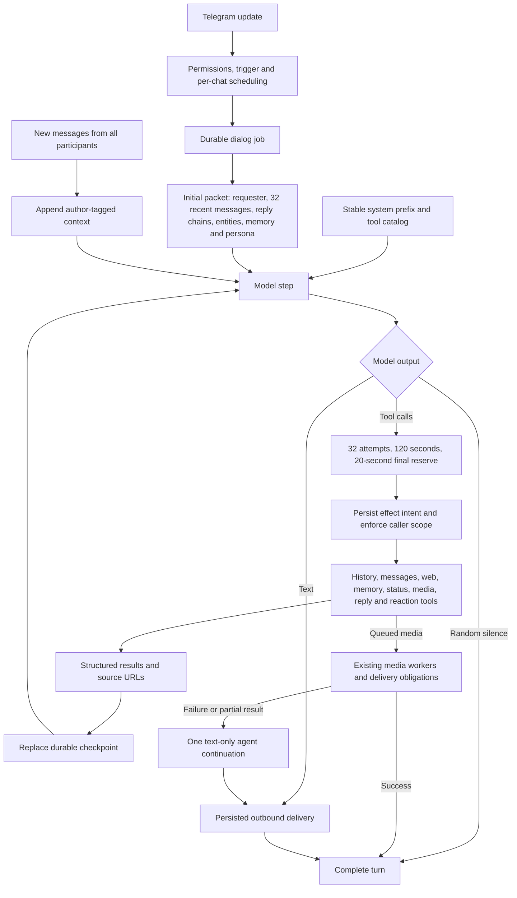

# Dialog agent

Addressed messages, random participation, image/music shortcuts, rates and translation enter the same dialog loop. Guest and runtime SAFE dialogs use that loop with their transport-specific tool restrictions. Payment, admin and Telegram transport handlers remain deterministic.

## Context and ownership

The system prefix contains stable rules. The first user packet contains all initial dynamic context, including structured history with message IDs, author IDs and reply edges. Later model steps append messages and tool results. They do not replace the initial packet.

Other participants can supply evidence. Only the original requester can change the active task. Independent requests retain their normal queued turns. `history_search` accepts an author filter. `get_messages` returns retained messages, embedded replies and nearby messages within the current topic and reset boundary. Their image references become available to subsequent tools.

When checking a contextual link, the prompt requires `crawl_url` for that exact page before broader research. Source URLs remain available throughout the turn. Delivery preserves the existing citation checks and URL provenance rules.

## Effects, limits and recovery

The runtime counts cached and failed tool attempts. Tools share the turn deadline and stop before the final reserve. Queue wait and asynchronous media work keep their existing separate limits.

The taskman job holds one current checkpoint. Effect intents and results use the existing event journal and per-job durability barrier. A completed effect is reused on retry. An interrupted effect with an unknown outcome stops automatic replay. This favors a visible failure over duplicate external actions.

Random turns receive a deterministic one-percent opportunity to offer a media gift. The model may decline it. Gifts cannot fulfill participant requests or edits. One gift attempt is allowed per turn, and gift jobs keep normal rate limits with lower priority than VIP orders.

`send_message` can address another retained message in the current topic. A quote must match its source exactly. Telegram receives the quote with its UTF-16 position. A final reply belongs to the original requester. Random turns can use a reaction or `finish_turn` without text.

## Memory and testing

Memory reads and writes use the authenticated requester, never an ID supplied by the model. Participants can change their own cards and shared chat/topic cards. They cannot change another participant's personal cards. Cross-chat recall and forgetting apply only to the requester's own facts in their private chat. Forgetting changes active cards and leaves source history intact.

SAFE dialogs use the production loop with captured delivery, synthetic media and separate in-memory cards. They cannot write production memory or start media jobs. The disposable Postgres test covers ownership, topic/reset boundaries, global forgetting and deduplication after updates. Loop tests cover the cached-call budget and immutable initial packet.

Key code: `openplotva-agent/src/lib.rs`, `openplotva-app/src/dialog_turn/session.rs`, `openplotva-app/src/agent_tools.rs`, and `openplotva-storage/src/agent_tools.rs` under `crates/`.
